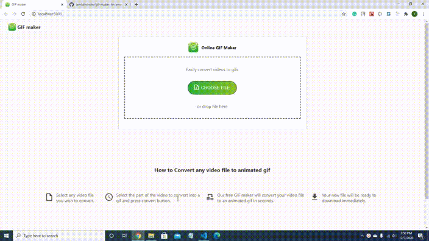

<!-- PROJECT LOGO -->
<br />
<p align="center">
  <a href="https://iamtalwinder.github.io/gif-maker/">
    
  </a>

  <h3 align="center">GIF maker</h3>

  <p align="center">
    An awesome tool to convert video files to animated gifs
    <br />
    <br />
    <a href="https://iamtalwinder.github.io/gif-maker/">View Demo</a>
    ·
    <a href="https://github.com/iamtalwinder/gif-maker/issues/new?assignees=&labels=&template=bug_report.md&title">Report Bug</a>
    ·
    <a href="https://github.com/iamtalwinder/gif-maker/issues/new?assignees=&labels=&template=feature_request.md&title=">Request Feature</a>
  </p>
</p>

<!-- TABLE OF CONTENTS -->
<details open="open">
  <summary>Table of Contents</summary>
  <ol>
    <li>
      <a href="#about-the-project">About The Project</a>
      <ul>
        <li><a href="#built-with">Built With</a></li>
      </ul>
    </li>
    <li>
      <a href="#getting-started">Getting Started</a>
      <ul>
        <li><a href="#installation">Installation</a></li>
      </ul>
    </li>
    <li><a href="#roadmap">Roadmap</a></li>
    <li><a href="#contributing">Contributing</a></li>
    <li><a href="#license">License</a></li>
    <li><a href="#contact">Contact</a></li>
  </ol>
</details>

<!-- ABOUT THE PROJECT -->

## About The Project

This project is a simple tool to convert video files to animated gifs.
It is different from other similar projects because all the CPU intensive
video editing work is done on the client-side using [wasm](https://webassembly.org/); there is no
server involved.

<p align="center">
    
</p>

### Built With

- [nextjs](https://nextjs.org/)
- [wasm](https://webassembly.org/)
- [ffmpeg.wasm](https://ffmpegwasm.et.r.appspot.com/#installation)

<!-- GETTING STARTED -->

## Getting Started

To get a local copy up and running follow these simple example steps.

### Installation

1. Clone the repo
   ```sh
   git clone https://github.com/iamtalwinder/gif-maker.git
   ```
2. Install NPM packages
   ```sh
   npm install
   ```
3. Run the development server
   ```sh
   npm run dev
   ```

<!-- ROADMAP -->

## Roadmap

See the [open issues](https://github.com/iamtalwinder/gif-maker/issues) for a list of proposed features (and known issues).

<!-- CONTRIBUTING -->

## Contributing

Contributions are what make the open source community such an amazing place to be learn, inspire, and create. Any contributions you make are **greatly appreciated**.

1. Fork the Project
2. Create your Feature Branch (`git checkout -b feature/AmazingFeature`)
3. Commit your Changes (`git commit -m 'Add some AmazingFeature'`)
4. Push to the Branch (`git push origin feature/AmazingFeature`)
5. Open a Pull Request

<!-- LICENSE -->

## License

Distributed under the MIT License. See [LICENSE](LICENSE) for more information.

<!-- CONTACT -->

## Contact

Talwinder Singh - [@iam_talwinder](https://twitter.com/iam_talwinder) - singhtalwinder790@gmail.com
